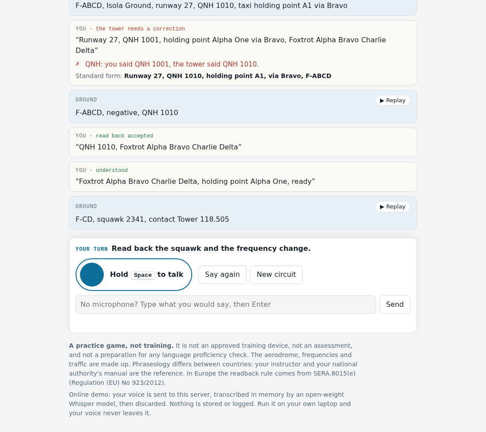

# phraseology

Practice the radio calls of a traffic circuit in English, out loud, on your own laptop.

The tower talks to you with a synthetic voice. You hold the space bar like a press-to-talk switch and answer. An open-weight speech model transcribes you on your machine, a set of plain rules checks your readback, and the circuit moves on. If the readback is wrong, the tower answers "negative" and gives the correct version, and you read it back again.

> **A practice game, not training.** This is not an approved training device, not an assessment, and not a preparation for any language proficiency check. The aerodrome, its frequencies and the traffic are made up. Phraseology differs from one country to the next: your flight instructor and your national authority's manual are the reference.



## What a game looks like

You are F-ABCD, a light aircraft parked at the flying club of Isola, a fictional controlled aerodrome (location indicator ZZZZ). One game is one session in the circuit:

1. call Ground and ask to taxi; read back the taxi clearance (runway, QNH, holding point, route);
2. report ready; read back the squawk and the frequency change to Tower;
3. call Tower; read back the line-up instruction, then the take-off clearance;
4. report downwind with your intention, then final; read back "cleared touch and go";
5. fly a second circuit to land, read back the landing clearance;
6. read back the instruction to vacate and the change to Ground, then taxi back.

Runway, wind, QNH, squawk and traffic are drawn at random each game. Up to three surprises can change the plan: "number 2, follow the Cherokee on base", "extend downwind" or "orbit right for spacing", "unable to approve touch and go due traffic, make full stop landing". Another aircraft shares the frequency, with its own voice. "Say again" works at any time, by voice or with the button.

After each transmission the page tells you what was missing or wrong ("QNH: you said QNH 1003, the tower said QNH 1013", "Put your callsign at the end of a readback"), and shows the standard form. There is no score.

## How it works

```
microphone ──► browser: 16 kHz mono WAV ──► faster-whisper (Whisper, open weights, CPU, int8)
                                                   │ transcript
                                                   ▼
                                  normalizer: "tree", "fife", "niner", "Alpha One",
                                  "121 decimal 805", "9 and 9 are 8" ──► tokens
                                                   │
                                                   ▼
                       rule checker ◄── scenario engine (state machine, seeded draw)
                                                   │ verdict + what was missing or wrong
                                                   ▼
                              next tower message ──► Piper (open-source TTS) ──► speaker
```

There is no language model in the loop. The open models hear and speak; the rules decide. Phraseology is meant to be said word for word, so the expected readback is known exactly from the message the tower sent, and checking it is a matter of rules, not of judgment.

A few details that took some care:

- **The prompt never contains the values.** Whisper gets an initial prompt with the vocabulary that never changes in a game (station names, callsign, radio words, runway and taxiway names). It never gets the QNH, the squawk or the wind: a value in the prompt pulls the transcript towards it, and a wrong readback would come out right.
- **Order matters in the prompt.** A prompt that ended with "say again" made Whisper drop a "say again" at the start of the clip, so the callsign goes last.
- **Tolerant normalization, strict comparison.** Whisper writes "niner niner eight" as "9 and 9 are 8" or "9R9R8", "four" as "for", "via" as "wire". The normalizer undoes these slips only where they can't change a value (a homophone becomes a digit only between digits or after a number keyword), then the checker compares values exactly.
- **Mishearings fail safe.** When Whisper mishears a correct readback, the checker rejects it and the tower asks again. In the round-trip tests below, no wrong readback was ever accepted.

## The rules the checker applies

In our own words. The legal basis in Europe is SERA.8015(e) of Commission Implementing Regulation (EU) No 923/2012 (Standardised European Rules of the Air).

- Always read back: the runway in use; clearances and instructions to enter, land on, take off from, hold short of, cross or backtrack on a runway (so line up, take-off, touch and go and landing clearances); altimeter settings; transponder codes; new frequencies.
- Other instructions, taxi instructions included, are read back or acknowledged so that it is clear you understood and will comply. This game asks for taxi instructions in full, as the UK and many aerodromes do.
- A readback ends with your callsign. A call that starts an exchange begins with it.
- You may shorten your callsign (F-ABCD to F-CD) only after the station has shortened it.
- Other messages are acknowledged: "wilco" when you will comply with an instruction, "roger" when you have only received information. "Roger" never replaces a readback.
- A wrong readback gets "negative" and the correct version; a missing part gets "read back ...".

The checker covers the phraseology of this one circuit. It is not a complete or authoritative statement of the rules.

## Run it on your laptop

Any recent laptop, Mac or PC, no graphics card needed: 4 CPU cores or more, 8 GB of memory, 2 GB of disk, a microphone (a headset is better), Python 3.9 or newer, and a browser. Internet is needed only once, to download the models; after that everything runs offline.

```bash
git clone https://github.com/dsiacci/phraseology.git
cd phraseology
python3 -m venv .venv
source .venv/bin/activate            # Windows: .venv\Scripts\activate
pip install .
python -m phraseology download       # Whisper small.en and two Piper voices
python -m phraseology serve --open   # http://localhost:8000
```

Add `?seed=71` to the address to replay the same game every time (handy to rehearse or to record a demo).

The browser asks for the microphone the first time. Hold the space bar while you speak, release when you're done (on a phone or tablet, hold the round button). No microphone? Type your transmissions in the box under the button, or play in the terminal:

```bash
python -m phraseology play
```

Options:

| Option | Default | |
|---|---|---|
| `--callsign` | `F-ABCD` | your registration, `F-xxxx` or `G-xxxx` |
| `--aerodrome` | `Isola` | the fictional aerodrome's name |
| `--altimeter` | `QNH` | or `QFE` |
| `--model` | `small.en` | `base.en` is lighter and a little less accurate |
| `--threads` | `0` | CPU threads for Whisper (0 = faster-whisper's default, 4) |
| `--tower-voice` | `en_GB-cori-medium` | any Piper voice in the voices folder |
| `--traffic-voice` | `en_US-norman-medium` | the other aircraft |

On an older machine or one with 4 GB of memory, use `--model base.en`.

## Tests

```bash
pip install pytest
python -m pytest                     # normalizer, checker, scenario, server: a few seconds
python -m pytest -m audio -s         # round trip through the real models: a minute or two
```

The audio tests close the loop with the real models: Piper speaks correct and wrong readbacks (wrong QNH, wrong squawk, wrong frequency, "cleared to land" instead of "cleared for take-off", wrong callsign, "roger" instead of a readback), Whisper transcribes them, and the checker has to reach the right verdict. They assert two things:

- no wrong readback is ever accepted;
- correct readbacks get through, with at most one in four misheard (the tower then asks again).

Measured on 2 October 2026 with `base.en` on a 2-core server and both voices: 14 of 14 wrong readbacks rejected, 14 of 16 correct ones accepted. The two misses were mishearings of the synthetic voices ("vacate red" for "vacate right", "Coxtrot" for "Foxtrot"). `PHRASEOLOGY_TEST_MODEL` and `PHRASEOLOGY_TEST_VOICES` change the model and the voices.

## Privacy

On your laptop, your voice never leaves the machine: the browser sends the recording to the local server on `localhost`, which transcribes it in memory and drops it.

The online demo works differently: your voice is sent to the demo server, transcribed in memory by Whisper, then discarded. Nothing is written to disk, and the server log holds only the method, path, status and duration of each request, never audio, text or addresses.

## Deploy

The online demo runs on a small CPU server (2 vCPUs, 4 GB, no GPU) with Whisper `base.en`, behind Caddy for HTTPS, as a hardened systemd service with a firewall, a one-at-a-time transcription queue, a 10-second cap on recordings and a per-address rate limit. Everything is in [`deploy/`](deploy/): [`deploy/README.md`](deploy/README.md) explains the setup, `setup-vm.sh` prepares a fresh Debian 13 server and `update.sh` pushes a new version.

## Sources

- Commission Implementing Regulation (EU) No 923/2012 (SERA), SERA.8015(e) on readbacks, and EASA's acceptable means of compliance and guidance material for it.
- Your national authority's phraseology manual, for example the UK CAA's CAP 413 or the French DGAC's phraseology manual. Nothing from them is reproduced here: every message in the game is our own wording of standard phraseology, with made-up data.

## Credits

Built on open work, with thanks:

- [Whisper](https://github.com/openai/whisper) by OpenAI: code and model weights under the MIT license. Models converted to CTranslate2 by SYSTRAN (`Systran/faster-whisper-small.en`, `base.en`, MIT).
- [faster-whisper](https://github.com/SYSTRAN/faster-whisper) (MIT) and [CTranslate2](https://github.com/OpenNMT/CTranslate2) (MIT), with the [Silero VAD](https://github.com/snakers4/silero-vad) model (MIT) for voice activity detection.
- [Piper](https://github.com/OHF-Voice/piper1-gpl) (GPL-3.0-or-later), which uses [espeak-ng](https://github.com/espeak-ng/espeak-ng) (GPL-3.0-or-later), running on [ONNX Runtime](https://onnxruntime.ai) (MIT).
- Voices from [rhasspy/piper-voices](https://huggingface.co/rhasspy/piper-voices): `en_GB-cori-medium` and `en_US-norman-medium`, trained by Bryce Beattie from public-domain LibriVox recordings.
- [NumPy](https://numpy.org) (BSD).

## License

GPL-3.0-or-later, the license of Piper, which this project uses. See [LICENSE](LICENSE).

## Challenge window

Built for the DEV "Hacktoberfest Weekend Challenge: Build for a Friend". The repository was started and finished during the challenge window (2 October 2026, 02:00 UTC to 5 October 2026, 06:59 UTC). Any commit made after the deadline will be listed here.
